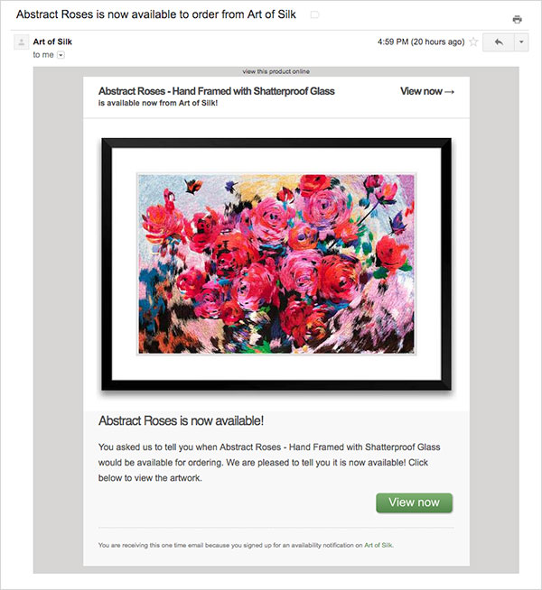

# Back In Stock - Notification Service

This Java application implements an automated notification service that emails customers when product variants they have requested notifications for are back in stock. It does this in a loop that:
1. Checks inventory levels for product variants
2. Emails notifications to customers for product variants that are back in stock
3. Updates notifications in the database to "sent=true" along with the date+time they were sent
4. Sleeps for a designated amount of time
5. Retrieves new notifications from the database

Example notification email template ([`src/main/resources/notification_email.html`](src/main/resources/notification_email.html)):

## Prerequisites

1. Java
2. Gradle
3. API access to your ecommerce website
4. SMTP email account
5. Notifications Database server (included -- see the [Database Server REST API](../RestApi))

## Installing

1. Download this repository
2. If you are not using Shopify
    * Implement the [`StoreApi`](../Objects/src/main/java/com/chrisleung/notifications/objects/StoreApi.java) and [`ProductVariant`](../Objects/src/main/java/com/chrisleung/notifications/objects/ProductVariant.java) Java interfaces for your ecommerce platform. Refer to [`ShopifyApi.java`](src/main/java/com/chrisleung/notifications/service/ShopifyApi.java) and [`ShopifyProductVariant.java`](src/main/java/com/chrisleung/notifications/service/ShopifyProductVariant.java) respectively as example implementations
    * In `Application.java` replace the default `ShopifyApi` with your own `StoreApi` implementation (on lines 44 and 66)
5. Rename `application.properties.blank` to `application.properties` and update values (see Deployment below for notes on Shopify settings)
6. Update the default email subject and body templates (optional) -- see Email Template below
7. Compile the application
    * Run the command `./gradlew bootRun` (will compile and run) or
    * Build an executable JAR file using `./gradlew build`, which will create a JAR file in `./build/libs/notification-service-0.1.0.jar`

## Deployment

This application can be run as a service or launched on-demand. If the JAR file does not execute on your system, execute the application with the command `java -jar build/libs/notification-service-0.1.0.jar`. You may need to remove the `executable = true` line from `build.gradle` and recompile the application first.

### Shopify Setup
1. Ensure each Shopify product variant has been assigned a corresponding product image. This can be done in either:
    * Your Shopify admin panel under Products
    * Exporting all products, making a backup copy, updating the variant image url in the CSV file, and uploading the modified file. (Be sure to enable the option to overwrite products with the same handle. If an error occurs, upload the backup copy to revert changes.)
2. Give this application API access by going to the "Apps" section in your Shopify store's admin panel. Click on "Manage Private Apps", then "Create a new private app". Follow the instructions to generate the key and password.
3. Update the Shopify configuration in the `application.properties` file. For the product and variant url settings, it should be `https://yourstorename.myshopify.com/admin/products/` and `https://yourstorename.myshopify.com/admin/variants/` respectively.

## Enabling HTTPS

For security, it's highly recommended (though not required) that you enable HTTPs when connecting to the database server. To do this:
1. Ensure the REST API URL in `application.properties` has `https` as the protocol identifier (not `http`)
2. If you have a self-signed certificate it will need to be added to your Java runtime's CA store. For information on how to do this, please see the [REST API server README file](../RestApi/README.md)

## Email Template

Default email subject and body templates are included and they can be customized:
* Email subject template is located in the `application.properties` file in the `my.notifications.email.subject.template` setting
* Email body template is located in [`src/main/resources/notification_email.html`](src/main/resources/notification_email.html)

If you update either template while the application is running, you must restart the application for the changes to take effect.

The following tags can be used in both the email subject and body templates, and are replaced with their respective values before an email is sent.

| Tag               | Value                                                            |
|-------------------|------------------------------------------------------------------|
| {{shop.name}}     | `my.notifications.email.shop.name` in `application.properties`   |
| {{shop.domain}}   | `my.notifications.email.shop.domain` in `application.properties` |
| {{product.title}} | `ProductVariant` interface `getProductTitle()` return value      |
| {{variant.title}} | `ProductVariant` interface `getVariantTitle()` return value      |
| {{product.handle} | `ProductVariant` interface `getHandle()` return value            |
| {{product.image}} | `ProductVariant` interface `getImageUrl()` return value          |

"Handle" refers to the unique handle used in the full URL path to this product variant. Example: http://mystore.com/products/{{product.handle}}.

To add support for additional tags, modify the `replaceTemplateShopTagsWithValues` and `replaceTemplateProductVariantTagsWithValues` methods in `EmailService.java`.

## Developer Reference

This project can be easily edited in [Eclipse for Java](http://www.eclipse.org/downloads/eclipse-packages/):
1. Ensure both Gradle and Eclipse are installed
2. Download this repository to your computer
3. In Eclipse, open **File** then **Import...**
4. Under **Gradle**, select **Existing Gradle Project** and click **Next**
5. On the **Import Gradle Project** click **Browse** and open the root directory of the project
6. Click **Finish**

### To Do

* Shopify Integration: Verify with Shopify that the Product, Variant, and Image ID fields are Long integer datatypes, and that this will not change in the future. (This REST API expects a long Integer. An invalid datatype would cause this REST API to send an error to the frontend and prevent the customer from submitting a new notification.)

## License

Copyright (c) 2018 [Chris Leung](https://github.com/chrislzm)

Licensed under the MIT License. You may obtain a copy of the License in the [`LICENSE`](LICENSE) file included with this project.
