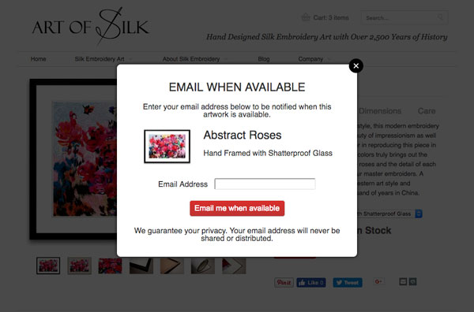

# Back in Stock

Make it easy for customers to sign up for and receive back in stock email alerts!

This application is composed of three components:

1. [Frontend](FrontEnd) - Allows a customer to request a back in stock notification on your website
2. [Notification Service](NotificationService) - Emails notifications to customers when products are back in stock
3. [Database REST API](RestApi) - Stores all notification data
    * **Frontend** creates new notifications in this database
    * **Notification Service** reads from and updates this database

## Prerequisites

1. Ecommerce website with API access (Shopify support built-in)
2. SMTP email account
3. Virtual private server or better

## Installing & Deploying

Please refer to each component's README file for instructions:
* [Frontend `README.md`](FrontEnd/README.md)
* [Notification Service `README.md`](NotificationService/README.md)
* [Database REST API `README.md`](RestApi/README.md)

## Built with

* [Spring](https://spring.io/) - Java framework used for the backend
* [Simple Java Mail](http://www.simplejavamail.org/)
* [Simple Logging Facade for Java](https://www.slf4j.org/)
* [Gradle](https://gradle.org/) - Java dependency management
* [MongoDB](https://www.mongodb.com/) - Database
* [npm](https://www.npmjs.com/) - JavaScript dependency management
* [jQuery](https://jquery.com/) - Frontend JavaScript library
* [jQuery Modal](jquerymodal.com)

## "Product" and "Variant" Definition

A "product" is defined to have one or more "variants", e.g. a ball (product) may be sold in different colors and sizes (variants). The words "variant" and "product variant" may be used interchangeably throughout the code and documentation. In the case of the [ProductVariant interface](Objects/src/main/java/com/chrisleung/notifications/objects/ProductVariant.java), the words refer to the combination of a variant's data with its respective product data into a single object. "Product" alone refers generally to a product and all of its variants.

## License

Copyright (c) 2018 [Chris Leung](https://github.com/chrislzm)

Licensed under the MIT License. You may obtain a copy of the License in the [`LICENSE`](LICENSE) file included with this project.
